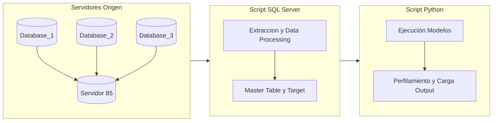
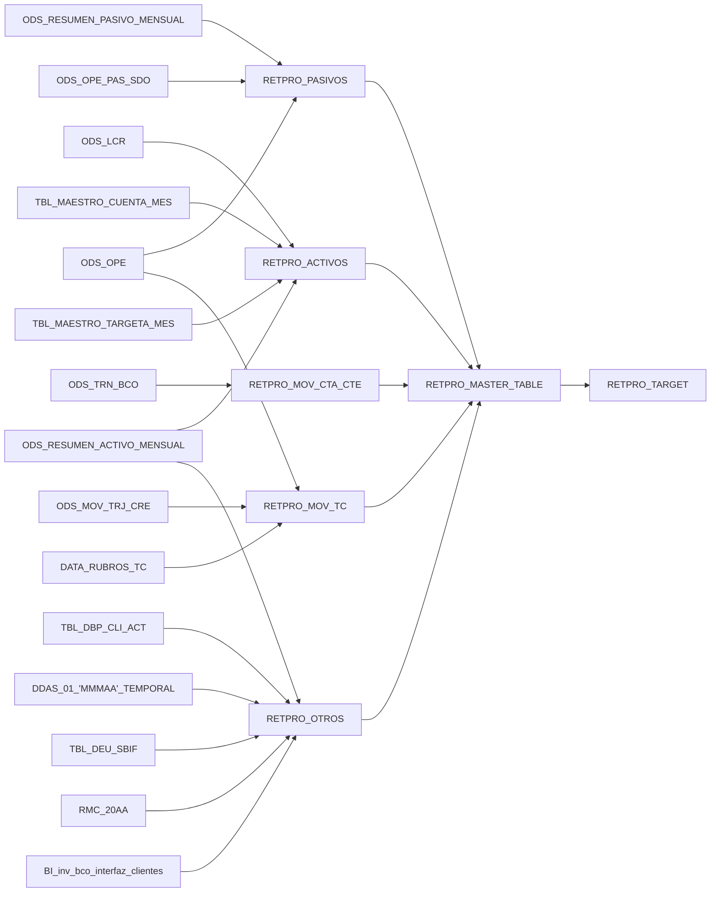
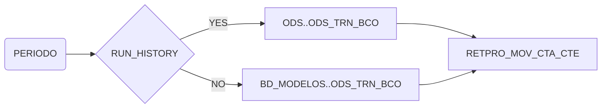
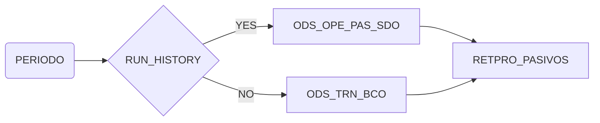
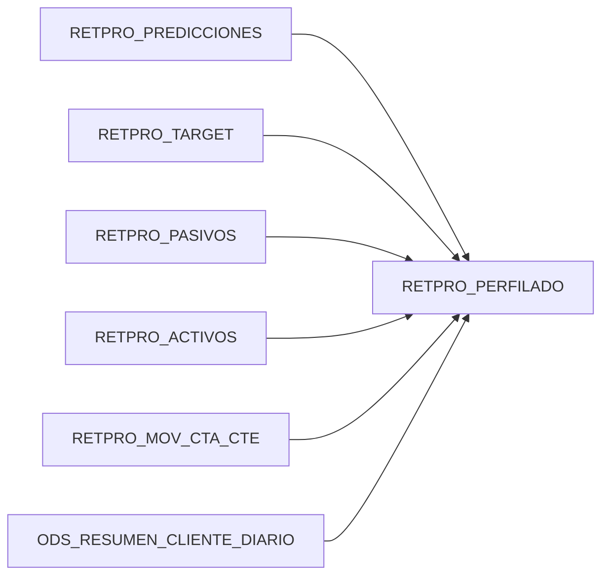

# Modelo de Retención Proactiva para Banca Personas - Banco Security - RETPRO BP

- Resumen: Modelo que predice la probabilidad de perdida de valor de activos, pasivos y transaccionalidad. Además de calcular la probabilidad de inactivación del cliente. Aplica para clientes BP y personas naturales

- Responsable: Alex Echeverría

- Periodicidad: Mensual usando último cierre de mes. La ejecución aproximada es a mediados de mes, dado el cierre de la tabla RMO

## Descripción General del Modelo

De acuerdo a la necesidad del Grupo Security de mejorar sus algoritmos de predicción del comportamiento de los clientes, se desarrolló un modelo para su negocio de "Banca Personas".

El modelo a desarrollar es una adaptación para el banco de un predictor de fuga de clientes o _churn prediction_. Este proyecto fue desarrollado con la consultora _McKinsey & Company_ el año 2020 y fue llamado "modelo de retención proactiva" por la necesidad del banco de poder predecir no solamente el momento de la fuga, sino también el instante en donde al cliente aún sea accionable y pueda ser retenido por acciones de ejecutivos del banco. 

De acuerdo a esto es que se definen dos grupos o _clusters_ de clientes:

- Clientes que al momento de querer irse del banco, ya están en estado de "inactivos" en relación al número de transacciones en su cuenta corriente y su tarjeta de crédito. 
- Clientes que al momento de optar por irse, han perdido "valor" en los campos de activos, pasivos y transaccionalidad de sus productos bancarios.

La construcción del modelo se realiza de la siguiente forma:

- Construcción de la base de datos o _Master Table_ a través de la información histórica del clientes provenientes de fuentes internas o externas al banco.
- Creación de la variable target con la que se entrenará el modelo
- Entrenamiento del modelo con 11 periodos de información de clientes y predicción de la probabilidad o _propensión_ de cada cliente a pertenecer a las targets generadas el próximo mes que el periodo en curso. El algoritmo de aprendizaje supervizado usado para el proceso será XGBoost, que es un algoritmo de tipo árbol de decisión optimizado que actualmente está siendo muy utilizado en modelos de _Machine Learning_.
- Creación de un perfilamiento de los clientes para realizar acciones comerciales de acuerdo a las propensión a la pérdida de valor (en activos, pasivos y transaccionalidad) e inactividad.

En la siguiente figura se muestra el flujo de trabajo del proyecto




Este código es una adaptación de lo realizado por la consultora, que fue realizado mayoritariamente usando el lenguaje R e información guardada en texto plano (csv) de consultas de bases de datos del banco.
**prueba de cambio**

## Inputs/Outputs del modelo

Se detalla en breve los Inputs del modelo y una breve explicación de su uso:
- ODS..ODS_RESUMEN_CLIENTE_MENSUAL
- ODS..ODS_RESUMEN_PASIVO_MENSUAL
- ODS..ODS_OPE
- ODS..ODS_OPE_PAS_SDO
- ODS..ODS_RESUMEN_ACTIVO_MENSUAL
- ODS.dbo.ODS_LCR
- [SRV-BC-D004].MDP.dbo.TBL_MAESTRO_CUENTA_MES
- [SRV-BC-D004].MDP.dbo.TBL_MAESTRO_TARJETA_MES
- ODS..ODS_TRN_BCO
- ODS..ODS_MOV_TRJ_CRE
- ODS..TBL_DBP_CLI_ACT
- SEGMENTOS..DDAS_01_'+@ano_mes_ddas_1+'_TEMPORAL (depende del periodo a obtener la información)
- SBIF..TBL_DEU_SBIF 
- IDN.dbo.RMC_20XX (depende del periodo a obtener la información)
- [SRV-BC-D004].Campañas.dbo.BI_inv_bco_interfaz_cliente

### Flujo de alimentación de tablas




Por simplicidad, no se incluye en el flujo la tabla pivote, que para todos los casos es la información de la tabla ODS..ODS_RESUMEN_CLIENTE_MENSUAL, de la cual se recupera el RUT y el periodo de la información de los clientes del banco que se incluyen en este análisis.


## Explicación general de Cada archivo

El modelo tiene dos carpetas, **sql** y **modelos**. En sql se encontrarán todas las querys necesarias para extraer todos los datos:

### Carpeta sql

- 00_contenido_tablas.sql: Resumen con la cantidad de datos totales de los últimos 3 periodos de todas las tablas físicas que alimentan al modelo.

- 01_pasivos.sql: Crea la tabla física RETPRO_PASIVOS que tiene información de los últimos 3 periodos (incluyendo al periodo seleccionado) de depósitos a plazo (DAP), de los saldos de cuenta corriente y sus reducciones en los 2 periodos pasados. La información se concatena a la información a la tabla pivote ODS..ODS_RESUMEN_CLIENTE_MENSUAL.

- 02_activos.sql: Crea la tabla física RETPRO_ACTIVOS con la información procesada para 3 periodos (incluyendo el periodo seleccionado), de los saldos mensuales de la línea de crédito (LCR), la información de activos del cliente, de cuenta corriente y tarjetas de crédito, como también sus reducción comparada a los 2 últimos periodos. La información se concatena a la información a la tabla pivote ODS..ODS_RESUMEN_CLIENTE_MENSUAL.

- 03_movimientos_cc.sql: Crea la tabla física RETPRO_MOV_CTA_CTE con la información procesada para 3 periodos (incluyendo el periodo seleccionado), de los montos y el número de movimientos por tipo de producto (cheques, depósitos, PAC, redcompra,transferencias, etc) de la cuenta corriente de los clientes, como también sus reducción comparada a los 2 últimos periodos. La información se concatena a la información a la tabla pivote ODS..ODS_RESUMEN_CLIENTE_MENSUAL

- 04_movimientos_tc.sql: Crea la tabla física RETPRO_MOV_TC con la información procesada para un periodo de los montos y el número de transacciones por tipo de movimiento (avance y compra nacional e internacional) y tipo de rubro (Farmacias, Educación,Líneas Aéreas, Hoteles, etc) operado por cliente con su tarjeta de crédito. La información se concatena a la información a la tabla pivote ODS..ODS_RESUMEN_CLIENTE_MENSUAL

- 05_otros.sql: Crea la tabla física BD_MODELOS..RETPRO_OTROS con la información procesada de múltiples fuentes, extrayendo
información de:
    - Sub Mora de Clientes: Tabla #mora
    - Sub Actividad: Donde se indica el estado "Activo", "Inactivo" y "Nuevo". Tabla #actividad. 
    - Sub Deuda Interna(BSEC) y Externa(SBIF): Tabla #sbif_3
    - Sub Ingresos: Datos de ingresos históricos de 3 periodos desde el periodo actual y un promedio a 12 meses. Tabla #rmc_2
    - Sub Demográficos: Información demográfica del cliente. Tabla #demográficos
    - Sub Inversiones: tabla #inversiones

La información se concatena a la información a la tabla pivote ODS..ODS_RESUMEN_ACTIVO_MENSUAL

- 06_master_table.sql: Crea la tabla física BD_MODELOS..RETPRO_MASTER_TABLE con la información de todas las tablas RETPRO_XXXX ya procesadas previamente, para el periodo seleccionado. La información se concatena a la información a la tabla pivote ODS..ODS_RESUMEN_CLIENTE_MENSUAL

- 07_target.sql: Crea las tablas físicas:
    - Sub BD_MODELOS..RETPRO_TARGET: Que contiene los indicadores de pérdida de valor por activos (TARGET_VAL_RED_ACT), pasivos (TARGET_VAL_RED_PAS), transaccionalidad (TARGET_VAL_RED_TRANS) y el indicador de inactividad (TARGET_INACTIVIDAD).
    - Sub BD_MODELOS..RETPRO_PRETARGET: Crea el campo flag_considerar_estricto que define a la población que se usará para entrenar el modelo.

En el capítulo "Construcción de Targets" se revisará más en detalle el procedimiento de construcción de estas variables.

#### Tablas Auxiliares 

Para la construcción de este modelo se tuvo que crear algunas tablas auxiliares. Por un lado hay algunas alimentan a las tablas del modelo y su función es almacenar registro histórico **por periodo** de tablas que utiliza el banco que solo registran información del mes en curso. Estas son:

- BD_MODELOS..RETPRO_SALDOS_CTA_CTE: Información histórica ODS..ODS_OPE_PAS_SDO, usada para la construcción de la tabla RETPRO_PASIVOS
- BD_MODELOS..ODS_TRN_BCO: Información histórica de ODS..ODS_TRN_BCO, usada para la construcción de la tabla RETPRO_MOV_CTA_CTE

para todas las tablas que se requiere de estas tablas auxiliares, es necesario cambiar un campo llamado @RUN_HISTORY, que se detalla en cada header de esos scripts.

### Flujo de alimentación de tablas Auxiliares

**RETPRO_PASIVOS**


**RETPRO_MOV_CTA_CTE**



## Carpeta Modelos
Por otro lado, se tienen tablas con información para construcción del modelo, como son:

- BD_MODELOS..RETPRO_DICCIONARIO_VARIABLES: Se definen todos los atributos de la tabla MASTER_TABLE que son utilizados para entrenar el clasificador, a través de una variable _dummy_ o binaria llamada "INCLUIR".
- BD_MODELOS..RETPRO_DATA_UMBRALES: Tabla con los umbrales de reducción de activos, pasivos, transaccionalidad y nivel de inactividad para cada etiqueta llamada "SEGMENTO_QP" y decil de ingresos (llamada "TRANCHE").
- BD_MODELOS..DATA_RUBRO_TC: Tabla con la descripción de los nombres de los rubros de las operaciones realizadas con la tarjeta de crédito. El campo Id_Rubro es el campo equivalente al MTC_COD_TRX_SIS_PRD.

Explicación más detallada se puede encontrar en el README de la carpeta sql

### Carpeta modelos

En la carpeta **modelos** se encuentran las implementaciones en python del modelo de retención proactiva:

- 01_modelos.py: Obtiene la información por periodos de la master table y de las target y crea el modelo de predicción, en base al algoritmo de clasificación XGBoost. 
- 02_perfilado.py: Construye, en base al modelo de clasificación construido en 01_modelos.py, la segmentación de clientes en base de su predicción (o propensión) a pérdida de valor e inactividad. El resultado es ingresado nuevamente con el periodo correspondiente al servidor 85, a la tabla BD_MODELOS.dbo.RETPRO_PERFILADO. Las tablas de _input_ y de _output_ el modelo son:




## Población objetivo y Construcción de Targets 

La población objetivo acordada con la unidad de inteligencia de negocios del banco son clientes:

1.- Pertenecientes a línea de "Banca Personas".

2.- Con al menos una cuenta corriente operando en el banco

3.- Pertenencientes a alguna segmentación relevante de clientes del banco, o sea 'PREFERENCIAL','PREFERENCIAL 2','PREMIER' o 'PRIVADA'.

4.- Un nivel de transaccionalidad en tarjetas de créditos y en la cuenta corriente mayor a un umbral de acuerdo a su clasificación de cliente (llamada 'SEGMENTO_QP'): 

**TRANS_TC_CTA = TOTAL_MOVS_ACTIVIDAD + TOTAL_TC**


TOTAL_MOVS_ACTIVIDAD Y TOTAL_TC se componen de las siguientes ecuaciones:


4.1. **TOTAL_MOVS_ACTIVIDAD = NUM_MOV_CHEQUES + NUM_MOV_DEPOSITOS + NUM_MOV_PAC + NUM_MOV_RED_COMPRA_ATM + NUM_MOV_TRANSFERENCIAS**


4.2.**TOTAL_TC  = N_MOVS_AVANCE_NAC + N_MOVS_AVANCE_INT + N_MOVS_COMPRA_NAC + N_MOVS_COMPRA_INT + N_MOVS_REVERSOS_NAC + N_MOVS_REVERSOS_INT**


El valor de TRANS_TC_CTA para pertenecer al grupo población depende de la segmentación del cliente de acuerdo al campo SEGMENTACION_QP

| SEGMENTACION_QP | TRANS_TC_CTA |
| ------ | ------ |
| PREFERENCIAL | >= 2 |
| PREFERENCIAL 2 | >= 2 |
| PREMIER | >= 3 |
| PRIVADA | >= 6 |

5.- Con saldo total en pasivos con el banco mayor a CLP 200.0000, de acuerdo a la ecuación:

**SALDO_TOTAL_PASIVOS = SLD_TOT_LIN_CRED + SLD_TOT_HIPOTECARIO + SLD_TOT_CONSUMO + SLD_TOT_COMERCIAL + SLD_TOT_TC**

O bien, con saldo total de activos con el banco mayor a CLP 500.000, de acuerdo a la ecuación:

**SALDO_TOTAL_ACTIVOS = MONTO_TOTAL_DEPOSITOS + SALDO_CTA_CTE_PROMEDIO + MONTO_INVERSIONES**

Los filtros 1, 2 y 3 se pueden obtener siguientes filtros en las querys de la tabla ODS..ODS_RESUMEN_CLIENTE_MENSUAL

- COD_TIPO_BANCA = 1
- CANT_CTA_CTE_PESOS > 0
- SEGMENTO_QP IN ('PREFERENCIAL','PREFERENCIAL 2','PREMIER','PRIVADA')

Los filtros de 4 y 5 se obtienen de cálculos realizados en la tabla BD_MODELOS..RETPRO_TARGET, consolidandose en la variable _dummy_ FLAG_CONSIDERAR_ESTRICTO


La construcción de la target está basada en la definiciones acordadas con las unidades de inteligencia de negocios de Banco, con los que se definieron las siguientes nociones:


## Cálculo de la variable Target 

Las variables target son de carácter binario, y consideran dos tipos de información para su cálculo:
1.	Variación entre el mes 0 y los meses 2, 3, 4 y 5 (flag inactividad para el modelo de inactividad)
2.	Umbral de corte
Cómo se mencionó anteriormente, en el caso de los modelos de reducción de valor, el umbral de corte es un parámetro que depende del segmento y del decil de saldos del cliente, y está definido para cada uno de los cuatro modelos (ver Excel umbrales.xlsx).
La siguiente fórmula determina el valor de la variable target para los modelos de reducción de valor (activos, pasivos y transacciones):

Cómo se mencionó anteriormente, en el caso de los modelos de reducción de valor, el umbral de corte es un parámetro que depende del segmento y del decil de saldos del cliente, y está definido para cada uno de los cuatro modelos (tabla BD_MODELOS..RETPRO_DATA_UMBRALES).

La siguiente fórmula determina el valor de la variable target para los modelos de reducción de valor (activos, pasivos y transacciones):


```math
RV_i=\begin{cases}
    1,& Variacion_{0,k} \geq Umbral_i,\,\, \forall k \,\, \text{en } \{2,3,4,5\} \\
    0,              & \text{otro caso}
\end{cases}
```

Donde $`RV_i`$ es el valor de la variable target para el cliente $`i`$, $`Variacion_{0,k}`$ es la variación porcentual entre el mes $`0`$ y el mes $`k`$, y $`Umbral_i`$ es el umbral para el cliente $`i`$.
En el caso del modelo de inactividad, se determina en base a la definición de inactividad del modelo, que como se describió anteriormente, se obtiene revisando que el número de transacciones del cliente sea menor al umbral, el cuál en este caso depende solo del segmento del cliente.
La fórmula para determinar si un cliente es inactivo en cierto periodo es la siguiente:

```math
flag\_inactividad_i=\begin{cases}
    1,& Trx_i < Umbral_i \,\,\forall\,\, k  \text{en } \{2,3,4,5\}\\
    0,              & \text{otro caso}
\end{cases}
```

Dónde $`flag\_inactividad_i`$ indica si el cliente $`i`$ es inactivo en el periodo, $`Trx_i`$ es el número de transacciones del cliente $`i`$ y $`Umbral_i`$ es el umbral para el cliente $`i`$.
Luego, la variable target para el modelo de inactividad, en una lógica análoga a la del modelo de reducción de valor, queda determinada por la siguiente fórmula:

```math
I_i=\begin{cases}
    1,& flag\_inactividad_k = 1 \\
    0,              & \text{otro caso}
\end{cases}
```

Dónde $`I_i`$ es el valor de la variable target del modelo de inactividad para el cliente $`i`$ y $`flag\_inactividad_k`$ es el flag de inactividad para el periodo $`k`$.

## Conjunto de Entrenamiento, Validación y prueba 

Como se mencionó, el archivo 01_modelos.py crea el modelo de predicción usando el algoritmo XGBoost, el cuál se entrena de la siguiente forma:

    1. Entramiento: 11 periodos 
    2. Validación: 1 periodo
    3. Prueba: 1 periodo

Como la variable _target_ necesita 6 periodos futuros para poder calcularse, el periodo de prueba puede ser como máximo 6 periodos previos al periodo actual.

Ejemplo: Si el periodo actual es 202108, los conjuntos de Entrenamiento, validación y prueba pueden como máximo adquirir estos valores.

    1. Entramiento: Datos periodo 202012 al periodo 202001
    2. Validación: Datos periodo 202101
    3. Prueba: Datos periodo 202102


## Lógica de perfilamiento 


Una vez obtenidas las predicciones con el modelo, se procede a determinar el perfil de cada cliente el cual dependerá del riesgo del cliente determinado por los modelos, y de varias variables relacionadas con características de negocio como: ingresos, saldos, tenencias de productos, etc. 
A continuación, se describe la lógica general del algoritmo que determina los perfiles:
1.	Determinar el nivel de riesgo del cliente para cada uno de los modelos de reducción de valor y de inactividad.
2.	Determinar el nivel de ingresos del cliente; alto, medio o bajo.
3.	Determinar grupo de prioridad del cliente en función de las dos variables anteriores; Prioritario, Secundario, Masivo, Masivo_2 o General.
4.	Dependiendo de en cuál de los modelos el cliente sea más riesgoso y de su nivel de ingresos, se determina un perfil asociado con el modelo de mayor riesgo y su rango de valor; NO_ACCION, RV_MASIVO, INAC_SECUNDARIO, INAC_MASIVO, RV_SECUNDARIO, RV_PRIORITARIO, INAC_PRIORITARIO.
5.	El perfil anterior se combina con información comercial del cliente para determinar el perfil final; INAC_CON_TC, INAC_SIN_PAC, INAC_SIN_TC, RV_ACTIVOS_CONSUMO, RV_ACTIVOS_HIPOTECARIO, RV_ACTIVOS_LC_TC, RV_PASIVOS_CTA, RV_PASIVOS_DEP_INV, RV_TRANSACCIONES_CONSUMO_FUERA, RV_TRANSACCIONES_SIN_CONSUMO_FUERA.


## En Construcción

1. Construcción del Main.py y su explicación en el README.md
2. Profundizar en el perfilado del modelo
3. Incluir la sección "Tiempos de Procesamiento"
4. Generar las tablas de métricas de desempeño y redactar la sección "Métricas de Desempeño del modelo"
5. Redactar la sección "Cómo instalar y Ejecutar"
6. Generar Contenido para los README.md de las carpetas "Modelos" y "SQL"


